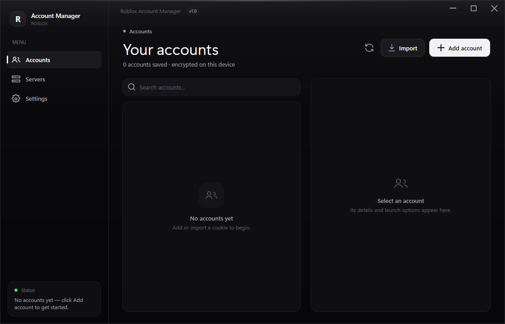
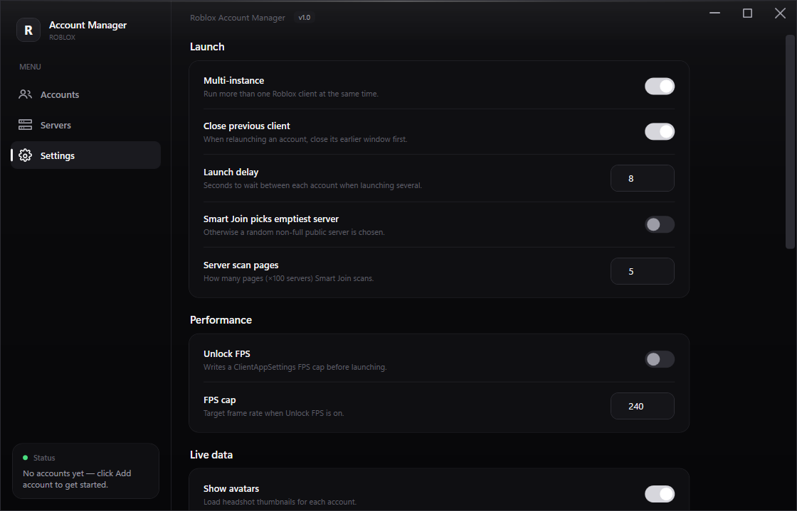
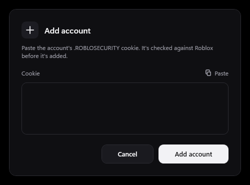

<div align="center">

# Roblox Account Manager

**A fast, private, beautifully minimal manager for your Roblox accounts.**
Add accounts once, launch any of them into any game with a click, run many at the same time — all from a clean, modern desktop app.

Windows · WPF · .NET 8 · single self‑contained `.exe`

<p align="center">
  <a href="https://github.com/Vaelixx/Roblox-Account-Manager/releases/latest"></a>
  <a href="https://github.com/Vaelixx/Roblox-Account-Manager/releases"></a>
  
  
</p>

</div>



---

## Highlights

- **One‑click launch** into any place — paste a Place ID, hit **Launch**. Optional Job ID joins a specific server automatically.
- **Multi‑instance** — run several Roblox clients at the same time.
- **Encrypted, local storage** — cookies never leave your machine and are never stored as plain text.
- **Live data** — avatars, presence (online / in‑game / studio) and Robux for every account.
- **Groups, aliases & notes** — organise accounts and see it all at a glance.
- **Server browser** — list public servers with player counts, join or copy a Job ID.
- **Open anywhere** — open an account signed‑in in a private Chromium browser, in the Roblox app, or view its public profile.
- **System tray** — close to tray and keep running in the background.
- **Zero setup** — one portable `.exe`, no .NET install required on the target PC.

---

## Screenshots

| Accounts | Settings |
|----------|----------|
|  |  |

---

## Install

### Option A — Download (recommended)

1. Go to the [**Releases**](../../releases) page and download the latest `Roblox Account Manager.exe`.
2. Put it in its own folder (it creates a `data\` folder next to itself).
3. Double‑click to run. Nothing else to install.

> Windows SmartScreen may warn about an unrecognised app the first time — click **More info → Run anyway**.

### Option B — Build from source

Requires the [.NET 8 SDK](https://dotnet.microsoft.com/download/dotnet/8.0).

```powershell
git clone https://github.com/Vaelixx/Roblox-Account-Manager.git
cd Roblox-Account-Manager

# quick dev build + run
dotnet run --project src\RobloxAccountManager.csproj

# produce the single-file, self-contained release exe  ->  .\dist\
dotnet publish src\RobloxAccountManager.csproj `
    -c Release -r win-x64 --self-contained true `
    -p:PublishSingleFile=true `
    -p:IncludeNativeLibrariesForSelfExtract=true `
    -p:EnableCompressionInSingleFile=true `
    -p:DebugType=none -p:SatelliteResourceLanguages=en `
    -o dist
```

The build produces a single portable `dist\Roblox Account Manager.exe` — copy it anywhere and double‑click to run.

---

## Quick start

1. Click **Add account** and paste the account's `.ROBLOSECURITY` cookie. It's validated against Roblox before it's added.
2. Select the account — its details and launch options appear on the right.
3. Enter a **Place ID** (the game preview loads automatically) and press **Launch**.
4. To organise, set an **Alias**, a **Description** and pick a **Group** from the dropdown (create new groups on the fly).

<div align="center"></div>

### Getting a cookie

The `.ROBLOSECURITY` cookie is what identifies a logged‑in account. Log into the account in a browser, open the cookies for `roblox.com`, and copy the `.ROBLOSECURITY` value (it starts with `_|WARNING:-DO-NOT-SHARE-THIS...`).

---

## Security

Your account cookies are the keys to your accounts — this app treats them accordingly:

- **Encrypted at rest.** The account file is encrypted with **Windows DPAPI** (tied to your Windows user) by default, or with a **master password** you set (AES‑256‑GCM + PBKDF2) from Settings.
- **Never plain text.** On top of the file encryption, **each cookie is individually DPAPI‑encrypted** — so even the decrypted store never contains a readable cookie.
- **Stays local.** Cookies are only ever sent to Roblox's own API endpoints, never anywhere else.
- **Private browser sessions.** "Open in browser" uses a **separate, private Chromium** with a per‑account profile — it never touches your normal browser or its logins.

> The `data\` folder holds your accounts, settings and browser profiles. It is git‑ignored and must never be shared or committed.

---

## How launching works

Roblox's own single‑instance lock (`ROBLOX_singletonMutex`) is held open so extra clients are allowed. To launch an account the app fetches a short‑lived **authentication ticket** from Roblox and starts the `roblox-player:` protocol with it — the same mechanism the official website uses. Only the `.ROBLOSECURITY` cookie is ever stored; no passwords are needed to launch.

---

## Settings overview

| Group | What you can control |
|-------|----------------------|
| **Launch** | Multi‑instance, close previous client, launch delay, Smart Join behaviour, server scan depth |
| **Performance** | Unlock FPS + FPS cap |
| **Live data** | Show avatars / presence / Robux |
| **Interface** | Hide usernames (for streaming), close to tray |
| **Browser** | Download / manage the private Chromium |
| **Security** | Set or remove a master password |

---

## Tech stack

- **.NET 8** (`net8.0-windows`), **WPF**, MVVM
- No third‑party UI libraries — the entire design system is hand‑built
- `System.Text.Json` storage, DPAPI / AES‑GCM encryption, `HttpClient` for the Roblox API
- Single‑file, self‑contained publish (win‑x64)

---

## Disclaimer

This is an unofficial, third‑party tool and is **not affiliated with, endorsed by, or sponsored by Roblox Corporation**. Use it responsibly and in accordance with Roblox's Terms of Service. You are responsible for your own accounts. Removing an account here only removes it from the manager, not from Roblox.

---

<div align="center">
Built with care · WPF + .NET 8
</div>
